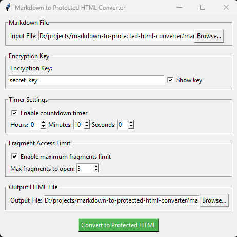

# Markdown to Protected HTML Converter

Этот проект представляет собой конвертер Markdown в защищенный HTML. Он позволяет вам конвертировать файлы Markdown в HTML, шифруя скрытые фрагменты с помощью ключа шифрования. Также вы можете установить таймер обратного отсчета и ограничение на количество фрагментов, которые могут быть открыты.

## Установка

1. Склонируйте репозиторий:
   ```
   git clone https://github.com/Vostbur/markdown-to-protected-html-converter.git
   ```
2. Перейдите в директорию проекта:
   ```
   cd markdown-to-protected-html-converter
   ```
3. Установите зависимости:
   ```
   pip install -r requirements.txt
   ```
## Использование



1. Запустите приложение:
   ```
   python main.py
   ```
2. Выберите файл Markdown, который вы хотите конвертировать.

   #### Фрагменты, которые вы хотите скрыть, поместите в теги `[hint] ... [/hint]`. Пример в `example.md`

3. Введите ключ шифрования.

4. Установите таймер обратного отсчета (опционально).

5. Установите ограничение на количество фрагментов (опционально).

6. Выберите место для сохранения HTML-файла.

7. Нажмите кнопку "Convert to Protected HTML".

## Собрать исполняемый файл (.exe)
   ```
   pip install -r requirements_build.txt
   python build.py
   ```
## Лицензия

Этот проект находится под лицензией MIT. Смотрите файл LICENSE для подробностей.

## Контрибьюторы

- [Alexey Rubtsov](https://github.com/vostbur)


